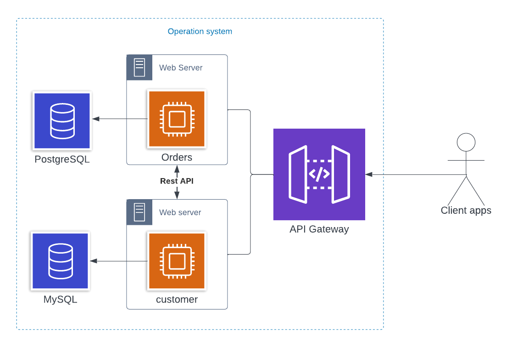

## Springboot microservice

This project is to show you how microservice communicate using Rest API using springboot. The architecture look like:



### System requirement to run this project

- Java 17 or later
- Apache maven
- MySQL 8.0 or later, alternative using docker
- PostgreSQL 15 or later, alternative using docker

After your install pre-requirement, then you can download the dependencies using `mvn clean -DskipTests package` command.

### Module customer

Module customer using MySQL Database to store data about customer it self, to run this module you can type `mvn -DskipTests clean -pl customer spring-boot:run` command. After web server started now you can access rest api from [http://localhost:9090]

Before you start, you need modified the environment on `application.yaml` inside folder `customer/src/main/resources` such as datasource connection

For testing the rest api, you can use Postman or the other http client and import this http-request.

```http request
### request to customer
GET http://{{host}}:{{port}}{{context-path}}/api/customer/v1/findById/cust01
Accept: application/json
```

### Module order

Module order using PostgreSQL database to store about transaction order, to run this module you can type `mvn -DskipTests clean -pl orders spring-boot:run` command. After web server started now you can access rest api from [http://localhost:9091]

Before you start, you need modified the environment on `application.yaml` inside folder `ordes/src/main/resources` such as datasource connection, service customer connection 

For testing the rest api, you can use Postman or the other http client and import this http-request.

```http request
### Store request order from customer
POST http://{{host}}:{{port}}{{context-path}}/api/order/v1/checkout
Accept: application/json
Content-Type: application/json
Timeout: 3s

{
  "userId": "cust01",
  "item": "Macbook Pro 13\" (A1723)",
  "qty": "2"
}
```
